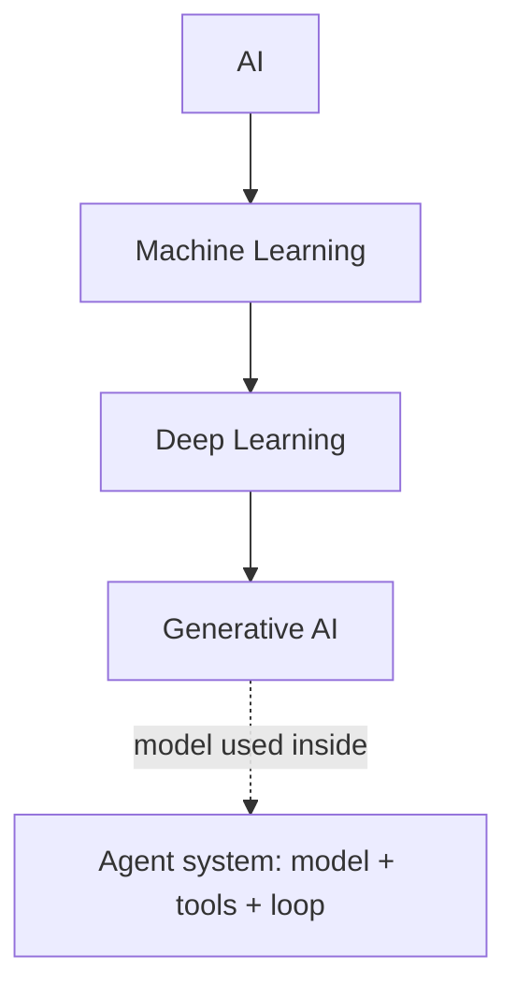
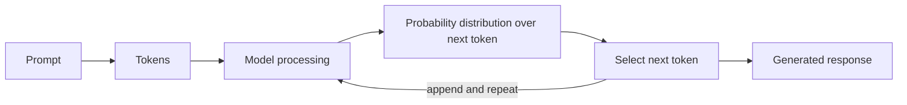
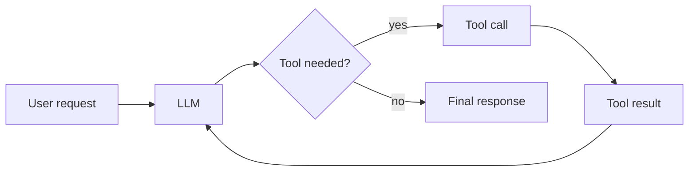

# Week 01 Questions

---

## Q1 - AI -> ML -> Deep Learning -> Generative AI -> Agents

### A - Answer

- **AI**: any system that performs tasks we associate with human intelligence (reasoning, perception, language, decisions).
- **Machine Learning (ML)**: AI where behaviour is *learned from data* instead of hand-written rules.
- **Deep Learning (DL)**: ML using many-layered neural networks; good at images, speech, text.
- **Generative AI**: DL models that *create new content* (text, images, code) rather than only labelling or predicting.
- **AI Agent**: a *system* built around a model (often an LLM) that can use tools and take multi-step actions toward a goal. Better seen as a workflow/system concept than a model type.

| Term  | Everyday example                                                                  |
| ----- | --------------------------------------------------------------------------------- |
| AI    | A chess program                                                                   |
| ML    | Spam filter learned from past email                                               |
| DL    | Phone face unlock / photo recognition                                             |
| GenAI | ChatGPT/Claude writing a summary                                                  |
| Agent | An assistant that searches the web, reads results, and drafts a report on its own |

**Relationship:** each of AI > ML > DL > GenAI is a narrower subset of the previous one. A generative model produces an output when prompted. An agentic system wraps a model in a loop: plan, call tools, observe results, decide the next step.

### E - Evidence

TODO-YOU: open 2 reliable sources (e.g., an IBM or Google/Stanford/MIT educational explainer on AI vs ML vs DL; the NIST AI glossary) and paste links. *(I suggested types of source; I did not verify specific pages.)*

### V - Verification

TODO-YOU: note whether each source agrees with the hierarchy above and any wording differences.

### R - Reflection

TODO-YOU: one sentence on what confused you (e.g., where agents fit).

---

## Q2 - Is everything that looks intelligent AI?

### A - Answer

| Case                                  | Classification           | Why                                     |
| ------------------------------------- | ------------------------ | --------------------------------------- |
| A. Calculator 25x16                   | Traditional software     | Fixed arithmetic algorithm; no learning |
| B. If temp > 80C show WARNING         | Traditional (rule-based) | Human-written explicit rule             |
| C. Spam detection from past email     | ML                       | Patterns learned from data              |
| D. AI assistant summarises a document | Generative AI            | Produces new text                       |
| E. ETA from traffic + history         | ML (prediction)          | Learned from historical/live data       |

**Difference:** a traditional program follows explicit instructions written by a human; an AI/ML system infers its behaviour from data and can handle cases nobody wrote a rule for, but its output is probabilistic and can be wrong.

### E - Evidence

Case E is supported by public sources: see Q8 (Google Maps ETA).

### V - Verification

TODO-YOU: check one definition of "rule-based vs ML" in a reliable source.

### R - Reflection

TODO-YOU.

---

## Q3 - What happens when you ask an LLM a question?

### A - Answer

- **Prompt**: your text. **Token**: a small chunk of text (word piece) the model works with. **Context**: all tokens the model can currently "see" (your prompt + earlier conversation + what it has generated so far).
- The model assigns a **probability** to every possible next token (**next-token prediction**), one token is selected, appended, and the process repeats until the **generated response** is complete.
- **Training vs inference:** training adjusts the model's parameters on huge text data; inference is using the finished model to answer prompts (no learning happens).
- **Fluent but false:** the model is optimised to produce *likely-sounding* text, not to check facts. A plausible sentence can be unsupported.

### E - Evidence

TODO-YOU: cite 1 reliable source (e.g., Google ML Crash Course LLM module, or the original paper [https://arxiv.org/abs/1706.03762](https://arxiv.org/abs/1706.03762) for background only; not required to read in depth).

### V - Verification

TODO-YOU.

### R - Reflection

TODO-YOU.

---

## Q4 - Hallucination experiment

> Chosen question (verifiable): **"Who introduced the Transformer architecture, in what year, and what was the paper's title?"**

### A - Answer

Claude's answer: *Attention Is All You Need*, Vaswani et al., 2017 (Google), proposing the Transformer that relies on attention instead of recurrence/convolution.

### E - Evidence

arXiv record: [https://arxiv.org/abs/1706.03762](https://arxiv.org/abs/1706.03762) shows title *Attention Is All You Need*, eight authors (Vaswani, Shazeer, Parmar, Uszkoreit, Jones, Gomez, Kaiser, Polosukhin), first submitted **12 Jun 2017**, abstract: proposes the Transformer "based solely on attention mechanisms".

### V - Verification

| Prompt               | Model  | Response summary                                                                | Verified claim                                | Evidence                                                                                                                                                    | Result                                                                                                                                                                                                                                                   | Lesson                                                                               |
| -------------------- | ------ | ------------------------------------------------------------------------------- | --------------------------------------------- | ----------------------------------------------------------------------------------------------------------------------------------------------------------- | -------------------------------------------------------------------------------------------------------------------------------------------------------------------------------------------------------------------------------------------------------- | ------------------------------------------------------------------------------------ |
| Exact question above | Claude | Title, Vaswani et al., 2017                                                     | Title, lead author, 2017, attention-only      | arXiv 1706.03762                                                                                                                                            | Correct                                                                                                                                                                                                                                                  |                                                                                      |
| Exact question above | Gemini | 2017, "researchers at Google", all 8 authors, title "Attention Is All You Need" | Title, year, 8 authors and order; "at Google" | arXiv 1706.03762 abstract + author block (ar5iv HTML version: [https://ar5iv.labs.arxiv.org/html/1706.03762](https://ar5iv.labs.arxiv.org/html/1706.03762)) | Correct on title, year, authors. "At Google" is mostly correct: 5 authors list Google Brain/Research; Gomez lists Univ. of Toronto ("work performed while at Google Brain"); Polosukhin lists no affiliation ("work performed while at Google Research") | Even a correct answer can hide an over-simplified detail; extra claims need checking |

Affiliations checked in the paper's author block (see table). Not verified: the conference/venue, which was not shown on the page I checked, so I do not claim it.

### R - Reflection

TODO-YOU: why can a confident answer have a weak factual basis? (Hint: see Q3, likely-sounding text.)

---

## Q5 - AI assistant vs search vs authoritative reference

> Chosen question: **"What is the difference between TCP and UDP?"**

### A - Answer

| Method        | Findings                                                                                                                                                                                                                                                                                       |
| ------------- | ---------------------------------------------------------------------------------------------------------------------------------------------------------------------------------------------------------------------------------------------------------------------------------------------- |
| AI (Claude)   | TCP is connection-oriented, reliable, ordered; UDP is connectionless, lightweight, no delivery guarantee. Use TCP for web/email, UDP for streaming/DNS/games.                                                                                                                                  |
| Web search    | **TODO-YOU:** search the question, note what 2-3 top pages say.                                                                                                                                                                                                                                |
| Authoritative | RFC 768 (UDP, J. Postel, Aug 1980): [https://www.rfc-editor.org/info/rfc768](https://www.rfc-editor.org/info/rfc768) describes a datagram mode of communication and points to TCP for applications needing reliable streams. TCP is specified in RFC 9293 (listed by IANA as TCP's reference). |

### E - Evidence

RFC 768 and RFC 9293 (above). **TODO-YOU:** open RFC 768 text (it is 3 pages) and confirm the "delivery and duplicate protection are not guaranteed" wording yourself; my search view of it was truncated.

### V - Verification

Compare on accuracy, explanation, traceability, ease of verification. **TODO-YOU:** one-line verdict per method (typical pattern: AI = best explanation, weak traceability; search = mixed quality; RFC = most authoritative, hardest to read).

### R - Reflection

When to require a primary source: anything where a wrong answer has cost (security, safety, legal, money, standards compliance).

---

## Q6 - What is an AI agent?

### A - Answer

| Concept              | Meaning                                                                                                |
| -------------------- | ------------------------------------------------------------------------------------------------------ |
| LLM                  | The model that predicts text                                                                           |
| LLM application      | Product wrapping an LLM (chat UI, prompts, memory)                                                     |
| RAG system           | LLM + retrieval of relevant documents added to the prompt                                              |
| Tool-using assistant | LLM that can call tools (calculator, search) when needed                                               |
| AI agent             | Tool-using system that plans and loops over multiple steps toward a goal, deciding its own next action |

**Agent vs chatbot:** a chatbot replies once from its own knowledge; an agent acts across steps, uses tools, and checks results.
**Example (non-VLSI):** a travel agent that searches flights, compares prices, checks your calendar, and drafts a booking summary for your approval.

### E - Evidence

TODO-YOU: link 1 reliable reference on agents/RAG (e.g., official docs from a major AI provider, or an educational source).

### V - Verification

TODO-YOU.

### R - Reflection

TODO-YOU.

---

## Q7 - Where should humans still decide?

### A - Answer

| Situation                                      | Possible failure                             | Required verification              | Approver              |
| ---------------------------------------------- | -------------------------------------------- | ---------------------------------- | --------------------- |
| Medical info/advice                            | Wrong dosage or diagnosis stated confidently | Check clinical guidelines/doctor   | Qualified clinician   |
| Legal/contract summary                         | Misses a clause or invents a rule            | Read the original contract and law | Lawyer                |
| Financial decision                             | Outdated or fabricated figures               | Official filings, current data     | Account owner/advisor |
| Publishing facts/citations                     | Fake or misattributed source                 | Open every source                  | Author/editor         |
| Sending email/payments/deleting data (actions) | Irreversible wrong action                    | Preview, dry run, test             | Human owner           |

**Rule:** *The higher the cost of being wrong and the harder to undo, the more a human must verify against primary evidence before acting.*

### E, V, R

TODO-YOU: one sentence each (e.g., Evidence: known AI hallucinated citations; your Q4 result).

---

## Q8 - Find AI around you

| System                                                                    | AI involved? | Task type      | Evidence / source                                                                                                                                                                                                                                                                                                                                                                                                                                                                                                                                                                                                                                                       | Conclusion    |
| ------------------------------------------------------------------------- | ------------ | -------------- | ----------------------------------------------------------------------------------------------------------------------------------------------------------------------------------------------------------------------------------------------------------------------------------------------------------------------------------------------------------------------------------------------------------------------------------------------------------------------------------------------------------------------------------------------------------------------------------------------------------------------------------------------------------------------- | ------------- |
| Gmail spam filter                                                         | Yes (ML)     | Classification | Google Cloud blog "Ridding Gmail of 100 million more spam messages with TensorFlow": [https://cloud.google.com/blog/products/gmail/ridding-gmail-of-100-million-more-spam-messages-with-tensorflow](https://cloud.google.com/blog/products/gmail/ridding-gmail-of-100-million-more-spam-messages-with-tensorflow) *(I found the Japanese version, [https://cloud.google.com/blog/ja/products/gcp/ridding-gmail-of-100-million-more-spam-messages-with-tensorflow](https://cloud.google.com/blog/ja/products/gcp/ridding-gmail-of-100-million-more-spam-messages-with-tensorflow) ; **verify the English URL opens**)*. It says protections combine ML models and rules. | ML plus rules |
| Google Maps ETA                                                           | Yes (ML)     | Prediction     | DeepMind/Google Maps work on Graph Neural Networks for ETAs, reported in Google Maps product manager statements and the paper "ETA Prediction with Graph Neural Networks in Google Maps"                                                                                                                                                                                                                                                                                                                                                                                                                                                                                | ML prediction |
| **TODO-YOU:** Netflix/YouTube recommendations                             | Likely       | Recommendation | Find Netflix Research / YouTube blog source. If none: write "Not enough public evidence to conclude."                                                                                                                                                                                                                                                                                                                                                                                                                                                                                                                                                                   |               |
| **TODO-YOU:** Phone face unlock                                           | Likely       | Recognition    | Find Apple/Google security documentation                                                                                                                                                                                                                                                                                                                                                                                                                                                                                                                                                                                                                                |               |
| **TODO-YOU:** Pick one rule-based thing (e.g., elevator, ATM, thermostat) | Probably No  | Rule-based     | State what you checked                                                                                                                                                                                                                                                                                                                                                                                                                                                                                                                                                                                                                                                  |               |

**Simpler rule-based alternative (required for at least one):** for spam, simple keyword rules ("lottery", "free money") catch some spam but fail on new wording, which is why ML is used.

---

## Q9 - Prediction, classification, generation

| Item                      | Type                                          | Reason                                                                    |
| ------------------------- | --------------------------------------------- | ------------------------------------------------------------------------- |
| A. House prices           | Prediction                                    | Outputs a numeric value                                                   |
| B. Image contains a cat   | Classification                                | Yes/no label                                                              |
| C. Email from instruction | Generation                                    | Creates new text                                                          |
| D. Customer will cancel   | Prediction (framed as classification: yes/no) | Forecasts future behaviour; caveat: binary label                          |
| E. Summarise paper        | Generation                                    | New text compressing source                                               |
| F. Fraudulent transaction | Classification                                | Fraud / not fraud                                                         |
| G. Image from text        | Generation                                    | Creates new image                                                         |
| H. Next word/token        | Prediction (of a category/token)              | Predicts the next item; in LLMs this is done as a probability over tokens |

**Why next-token prediction is fundamental:** writing, summarising, coding and Q&A are all produced by repeatedly predicting the next token; the "application" is just different prompts steering that same mechanism.

### E, V, R

TODO-YOU. (Caveat: D and H can be argued as classification or prediction; say which you chose and why.)

---

## Q10 - Personal AI verification protocol

| #   | Step                                             | Why it exists / failure it catches                   |
| --- | ------------------------------------------------ | ---------------------------------------------------- |
| 1   | Define the problem and success criteria          | Catches vague tasks and answering the wrong question |
| 2   | Inspect assumptions in the prompt and output     | Catches hidden/incorrect assumptions                 |
| 3   | Check evidence and sources (open them)           | Catches hallucinated or unsupported claims           |
| 4   | Cross-check with an independent/primary source   | Catches errors shared by one tool                    |
| 5   | Test the result (run, calculate, try an example) | Catches outputs that look right but don't work       |
| 6   | Assess risk and impact                           | Decides how much human approval is needed            |
| 7   | Decide: accept / revise / reject, and log it     | Creates traceability and learning                    |

**Worked example (non-VLSI):** AI says "the Great Wall is visible from space." Define: is this true? Assumption: "space" undefined. Evidence: ask for a source; cross-check NASA material. Test: compare with astronaut statements. Decision: revise to a qualified claim or reject if unsupported. Log it.

### E, V, R

TODO-YOU: reflect on which step you'd skip under time pressure, and why that's risky.
